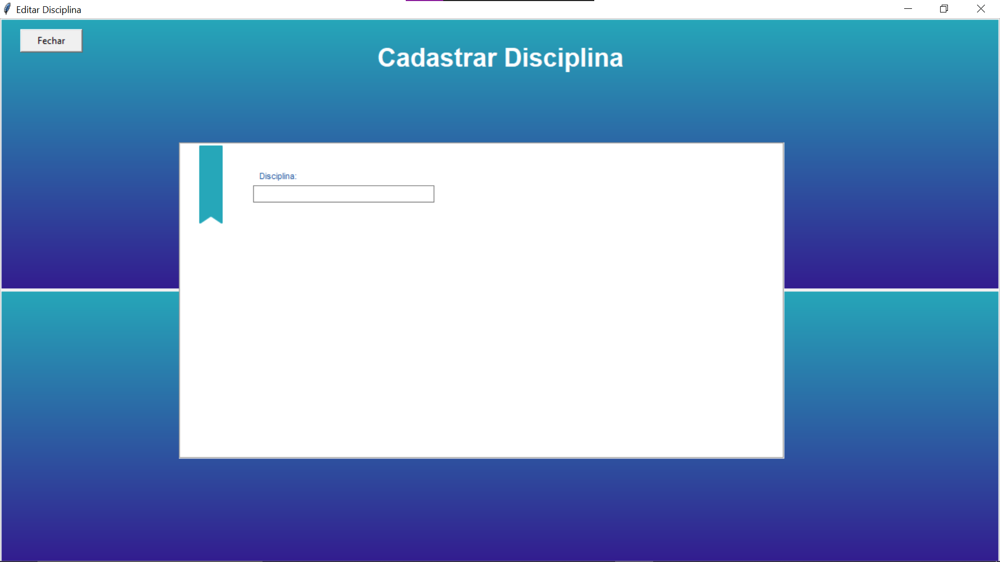

# alterar.py

- [ ] Ao Abrir direto abre todas as funçoes, mas ao abrir a partir de cadastro abre apenas um campo de texto chamado disciplinas 

# cadastrar.py & disciplinas_backend.py

- [ ] Tela de cadastro de disciplinas não esta de acordo com o banco de dados, Corrigir as querys.

- [ ] Corrigir cadastro de professores da disciplinas

- [ ] Corrigir caixas de texto, campos de valor int não podem ser inseridos String

- [ ] Caixa de texto de ementa não pode ser uma caixa de texto padrão. Deve ser uma TextBox onde sera aceito quebra de linha e maior facilidade de manipulação pelo usuário

# Geral

- [ ] Manter padrão de nomes para as mesmas imagens

- [ ] Manter padrão para Variaveis 

- [ ] Criar um padrão de organização de nomes de arquivos

- [ ] Organizar melhor os arquivos dentro do Diretório 
